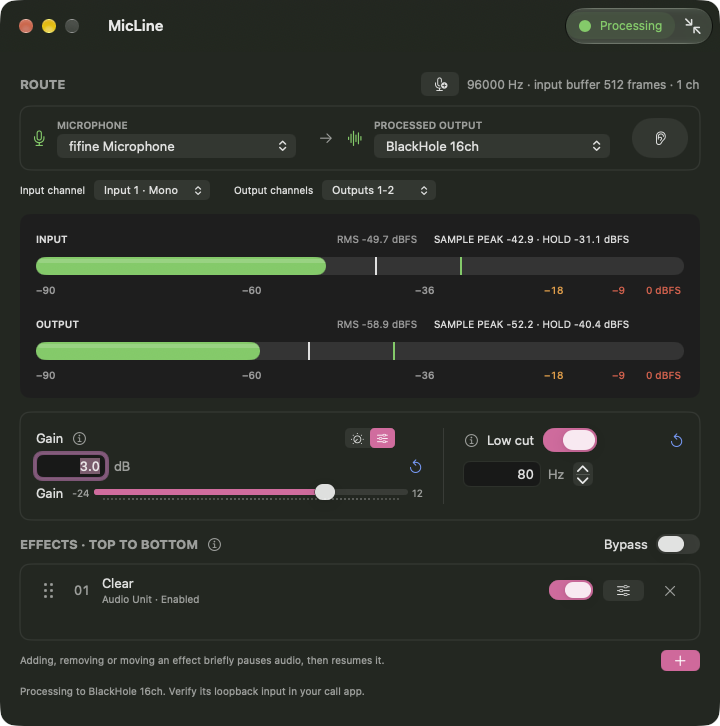

# MicLine

Shape your microphone audio before it reaches your call. MicLine is a native
macOS app for adjusting gain, reducing rumble and arranging Audio Unit effects
for your call or recording app.

**[Download MicLine](https://github.com/thesammykins/micline/releases/latest)** ·
[What’s new](CHANGELOG.md) · [Get help](SUPPORT.md) · [Privacy](docs/PRIVACY.md)

Requires **Apple silicon and macOS 27 or later**. Releases are signed and notarized.

## Make your microphone sound like you

- **See your levels.** Input and output meters show average level, sample peaks
  and clipping; gain and low cut sit beside your effect chain.
- **Use your effects.** Add registered Audio Units, open their controls and drag
  them into order. Editing a running chain briefly pauses audio, then resumes it.
- **Compare your sound.** Bypass effects and low cut while keeping the same gain.
  Optional headphone monitoring lets you listen to the processed output.
- **Keep it close.** Use the main window or menu-bar controls. Closing the window
  keeps processing; quitting stops it.

## Set up, one step at a time

Guided setup walks through microphone permission, input selection, raw gain,
optional Apple Sound Isolation and compression, then connecting your call app.
Short, silent video guides explain the controls at each stage.

1. **Download and install.** Open the DMG, drag MicLine to Applications and launch it.
2. **Set up your microphone.** Allow microphone access and follow the sound check.
   You can check the raw microphone before installing a virtual audio device.
3. **Choose a virtual output.** Use an installed device such as
   [BlackHole](https://existential.audio/blackhole/). BlackHole is installed
   separately and is optional if you already use another compatible virtual device.
4. **Connect your other app.** Select that same virtual device as its microphone,
   start MicLine, and check the other app's input meter. Keep its speaker output
   on your usual headphones.

For a fuller walkthrough, see the [setup guide](docs/GETTING-STARTED.md).
Repeat setup from **Settings → Audio Setup**. Login launch and automatic
processing are separate opt-in settings. Automatic processing uses only your saved
virtual-output route; it never falls back to speakers.

## A few useful details

Use headphones for monitoring to avoid feedback. MicLine asks you to confirm the
physical output, and never restores monitoring automatically or changes your
hardware volume, system audio defaults or shared device sample rates.

Audio Unit compatibility depends on the effect; third-party plug-ins may run
inside MicLine's process. **VST2/VST3 hosting and per-app audio routing are not
supported.** BlackHole's driver is not bundled. See [help and troubleshooting](SUPPORT.md)
if a device or effect isn't behaving as expected.

## Development

To develop locally, read the [MicLine development skill](.agents/skills/micline-development/SKILL.md).
It covers prerequisites, signing, build and test commands, architecture,
diagnostics and release tooling. [Contributing](CONTRIBUTING.md) explains how to
report bugs and submit changes.

## Support MicLine

<!-- Unmodified official Ko-fi creator-kit button, retrieved 2026-09-22.
Source: https://cdn.prod.website-files.com/5c14e387dab576fe667689cf/670f5a01c01ea9191809398c_support_me_on_kofi_blue.avif
Permission/provenance: https://more.ko-fi.com/brand-assets and https://help.ko-fi.com/hc/en-us/articles/360021025553-How-to-use-Ko-fi-with-Github
SHA-256: 2bdae72d7087b7ab46de81154c12cf5cdf42999155cc7c56592969ea5b8a7083 -->

## License

Copyright 2026 Sammykins. [Apache-2.0](LICENSE); third-party terms are listed in
[NOTICE](NOTICE). Report vulnerabilities through [private security reporting](SECURITY.md).
