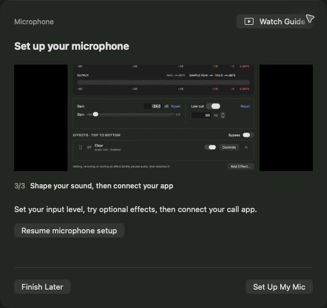

# Set up MicLine

Install the [latest release](https://github.com/thesammykins/micline/releases/latest)
in Applications. Guided setup opens on first launch; reopen it from
**Settings → Audio Setup → Run Guided Setup**.

## Start with the microphone

Allow microphone access when prompted, then choose the physical microphone and
its input channel. If access was denied, enable MicLine in **System Settings →
Privacy & Security → Microphone** and return to setup.

Open the sound check and speak as you would on a call. It measures the raw input
before MicLine's gain or effects, without sending sound to an output or saving
microphone audio. Each check stops after five seconds; repeat as needed.

Try speaking peaks around −18 to −6 dBFS and leave room for louder phrases. Adjust
the microphone's own gain or your distance. Lowering MicLine's gain cannot repair
clipping that already occurred in the microphone.

## Try effects, then compare

Setup offers Apple's Sound Isolation and a gentle compressor. Both are optional.
Choose headphones and confirm the named output before listening. Compare before
and after, then **Keep** the effect or **Undo** the trial. Avoid stacking several
noise-removal effects across MicLine and your call app.

In the main window, **Add Effect** opens registered Audio Units. Drag an effect's
grip to change its order; effects run top to bottom. **Controls** opens its editor.
Adding, removing or moving an effect briefly pauses a running chain and resumes it.
**Bypass** skips effects and low cut but keeps gain, so you can compare your sound.

Use **Watch Guide** for the short recording attached to the current setup step.
The videos are silent, loop with captions, and have written steps. Reduce Motion
turns off autoplay. The app includes the guides; no separate video download is needed.

## Connect your call or recording app

Choose an installed virtual audio output in MicLine. BlackHole is one option;
other compatible virtual devices can be selected. A virtual device carries audio
between apps—it does not play through speakers by itself.

In your call or recording app, choose that same virtual device as its microphone.
Keep speaker output on your normal headphones. Start the output check, speak,
and confirm that the other app's input meter moves. MicLine cannot confirm
reception inside another app for you.

If you need BlackHole, use the app's **Need a virtual microphone?** guide or the
[official download](https://existential.audio/blackhole/). It is installed separately.
After installation, rescan devices and reopen audio apps. Follow the installer's
instructions if the device is still unavailable. The vendor's
[manual installation guidance](https://github.com/ExistentialAudio/BlackHole/wiki/Installation)
also describes reloading the audio service: it interrupts audio and may need
administrator access. MicLine never does that automatically.

## Everyday use

Start processing before your call. Closing the window keeps audio running; use
the menu-bar controls to return to it. Stop or Quit ends processing. Settings
contains separate options for login launch and starting your saved virtual route
automatically. Neither enables physical monitoring on launch.

For headphone monitoring during processing, select a physical monitor in
**Settings → Audio Setup**, then use the ear button in the main window. Confirm
the device and use headphones to avoid feedback. MicLine does not change hardware
volume, system defaults or shared device sample rates.

## If something is silent

- **No input meter:** check microphone permission, the device's mute switch and
  the selected input channel. Reconnect or choose the microphone again.
- **Input moves but output does not:** try bypassing effects and check gain.
  Some noise-removal effects suppress quiet room noise by design.
- **MicLine output moves but your call app is silent:** check that app's selected
  microphone, permission and mute state; reopen its audio session if necessary.
- **A check stops during configuration:** close the check and retry. If it keeps
  happening, restart MicLine and include the sequence in a bug report.

For plugin compatibility or reproducible failures, see [Getting help](../SUPPORT.md).
